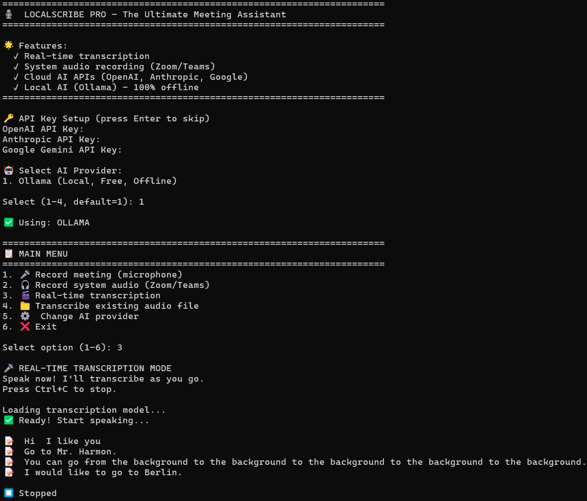

# 🎙️ LocalScribe PRO

**The Ultimate Free, Private, Offline AI Meeting Assistant.**

Stop paying $20/month for Otter.ai or Fireflies! LocalScribe PRO runs entirely on your laptop. No internet required. No cloud uploads. Your meetings stay 100% private.



## 🌟 Features
- 🎤 **Record Meetings** directly from your microphone
- 🎧 **System Audio Recording** - Record Zoom/Teams calls directly!
- 🎬 **Real-time Transcription** - See text as you speak
- 🤖 **Local AI (Ollama)** - 100% offline, free, and private
- ☁️ **Cloud AI Support** - Plug in OpenAI, Anthropic, or Google APIs for blazing fast cloud processing
- 📋 **Auto-Summarization** - Automatically generates meeting summaries
- ✅ **Action Items** - Extracts tasks and assigns them automatically
- 🔒 **Zero-Knowledge** - Your data NEVER leaves your computer (unless you choose cloud AI)

## 🆚 LocalScribe PRO vs Paid Tools

| Feature | LocalScribe PRO | Otter.ai | Fireflies.ai |
|---------|----------------|----------|--------------|
| **Cost** | **$0 (FREE)** | $203/year | $120/year |
| **Privacy** | **100% Offline** | Cloud Only | Cloud Only |
| **Storage** | **Unlimited** | Limited | Limited |
| **AI Choice** | **Local + 3 Cloud Options** | 1 | 1 |

## 🚀 How to Run

1. Install [Python](https://python.org) and [Ollama](https://ollama.com).
2. Pull a local AI model: `ollama pull phi3`
3. Install the required packages:
   ```bash
   pip install ollama faster-whisper sounddevice soundfile openai anthropic
